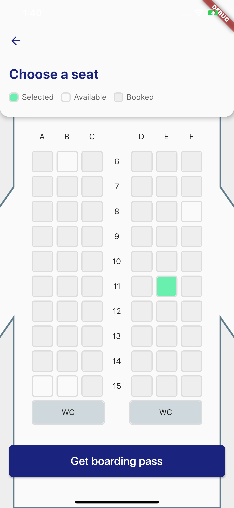
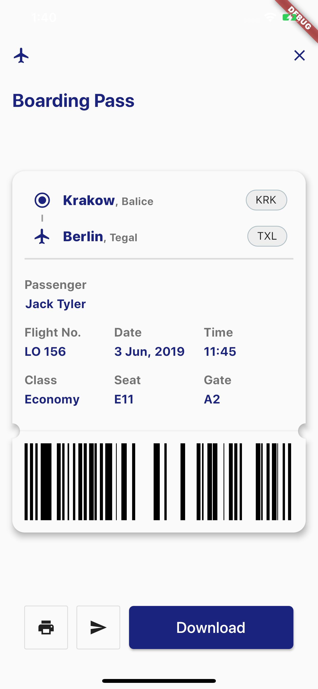
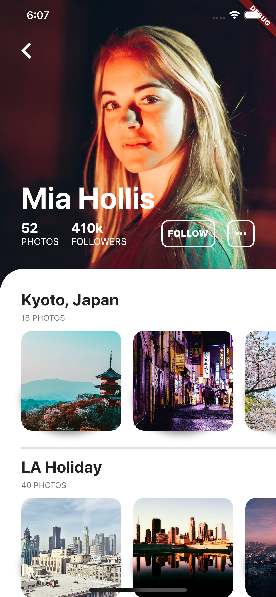
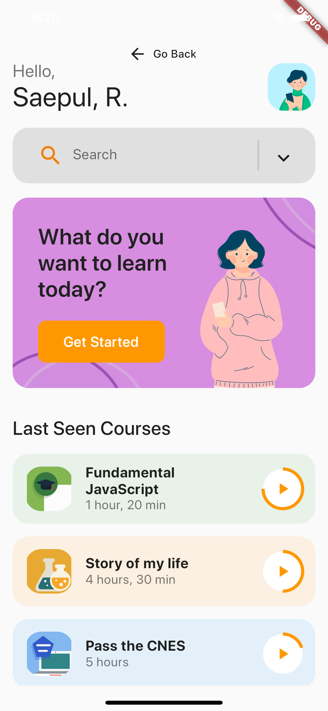
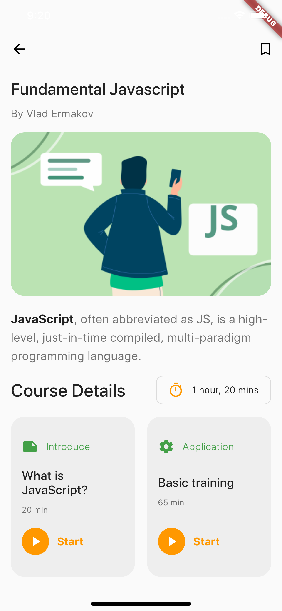
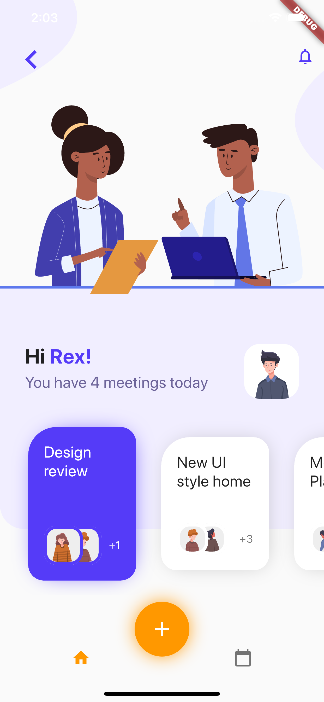
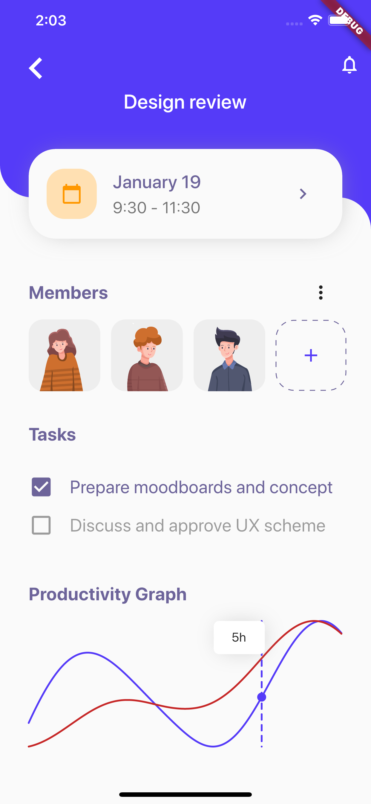
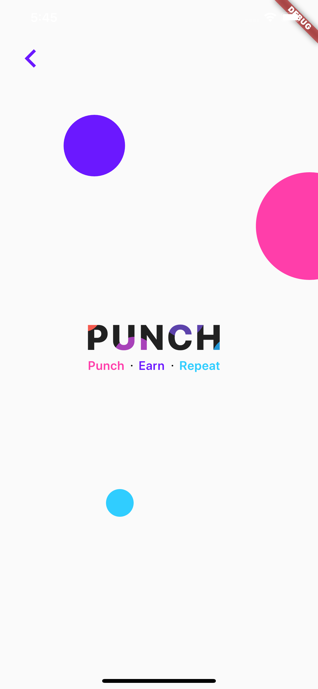
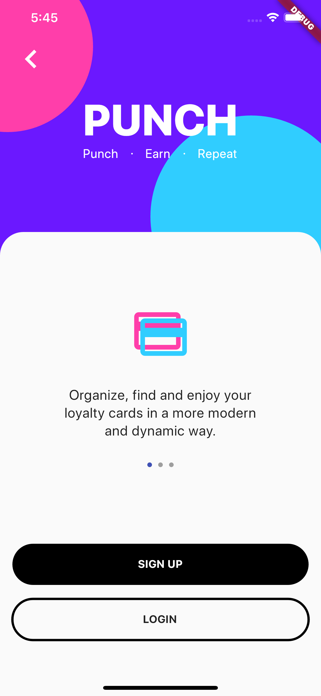
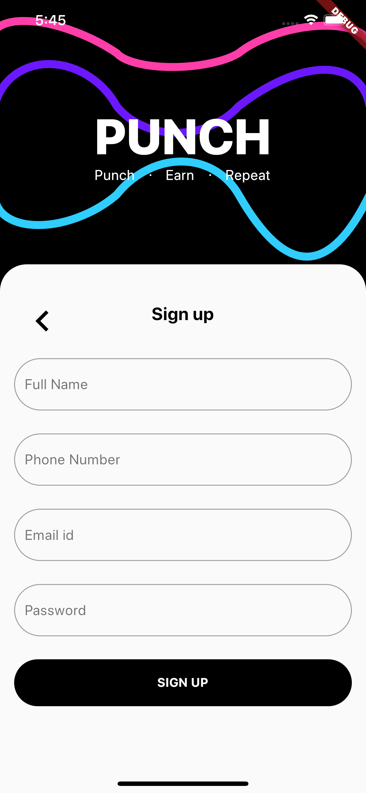

See also my [Flutter algorithm visualizations](https://github.com/Nolence/flutter_challenges)

# Recreated Dribbble Designs

These designs have partial to full functionality and were recreated by me in native Flutter using minimal libraries.

# [Airline Design](https://dribbble.com/shots/9706802-Check-in-flow-LOT-iOS-App/attachments/1736215?mode=media)

|       |       |
|------------|-------------|
|  |  |

# [User Profile](https://dribbble.com/shots/9712939-User-Profile-Daily-UI-006/attachments/1742767?mode=media)

# [Tech Education](https://dribbble.com/shots/9779804-Learning-Platform-Mobile-App/attachments/1810682?mode=media)

|       |       |
|------------|-------------|
|  |  |

# [Design Meetings](https://dribbble.com/shots/9565876/attachments/1593881?mode=media)

|       |       |
|------------|-------------|
|  |  |

# [Punch App](https://dribbble.com/shots/9849928-Loyalty-cards-collection-product-Punch-app-version-2)

|       |       |       |
|------------|-------------|-------------|
|  |  |  |